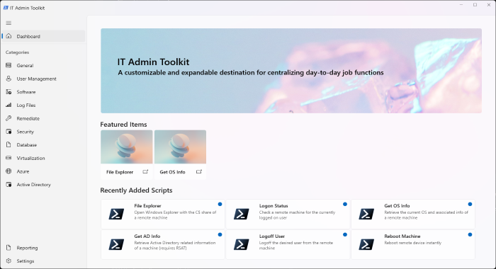
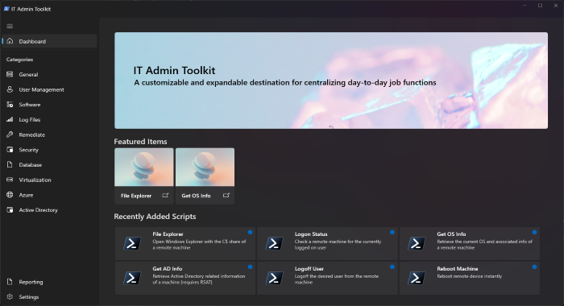

# IT Admin Toolkit
## A customizable and expandable destination for centralizing day-to-day job functions.
**Created by: [Nathan Kasco](https://nkasco.com)**

**Current Functionality (Alpha):**
- Core App - Open source, free, forever - Allow community contributions and provide credit to authors.
    - Accessibility - Light or Dark Mode support and Per-Monitor v2 DPI Aware
- Basic Settings Functionality
- Configurable XML to add categories or scripts as needed
    - View examples within XML folder, all icons must be [Segoe MDL2 Assets](https://learn.microsoft.com/en-us/uwp/api/windows.ui.xaml.controls.symbol?view=winrt-22621)
- Launcher functionality for PowerShell 5 or PowerShell 7 scripts (powershell.exe or pwsh.exe)
    - Configuration options for passing a target machine as a script parameter (Optional)
- Remote Machine Info Panel - Quickly gain at a glance key information for inputted machines as needed
    - Note: At present this feature is only supported when remote connections can be made without explicitly passing credentials (i.e. either an open network share, same account on both machines, or a domain that allows it). Therefore it may be expected that this doesn't work in all environments. Initiating connections with different credentials will come at a later time. PSRemoting also must be enabled, optionally initiating connections with DCOM instead of WSMan will also come later.
- Automatic update support - Choose whether you want to control update cycles or take them automatically

**Features/In-Progress Goals:**
- Launcher - Provide a script launcher that can be easily customized (initially with XML) to centralize and launch script files across various languages.
    - To be added: CMD, BAT, VB, WSF, PY
    - Built In XML editor UI
- Task Scheduler - Create scheduled tasks, local or remote, quickly and easily from your script library.
- Reporting - Built-in logging and reporting statistics based on usage.
- Role Management - Manage groups of users (likely via AD Group Enrollment) to control script visibility.
- Built-In PowerShell Console - Choose whether you want your scripts to run in an integrated console or as a standalone process.
- PowerShell Gallery integration -  Make it easy to add PS gallery scripts to your library from within the tool.
- Eventually, explore cross-platform support for macOS and Linux.

**Prerequisites (In-Progress):**
- At a minimum if you just want to run the built app you will need the proper [Windows App Runtime Redist](https://docs.microsoft.com/en-us/windows/apps/windows-app-sdk/downloads#current-releases) (Currently: Version 1.2.2) installed, this project is primarily targeted towards x64 but please feel free to open an Issue or PR for other platforms if you find they aren't working.
    - For development - environmental requirements can be found [here](https://docs.microsoft.com/en-us/windows/apps/winui/winui3/create-your-first-winui3-app#unpackaged-create-a-new-project-for-an-unpackaged-c-or-c-winui-3-desktop-app)
    - Ensure you install the proper [C# Windows App SDK Templates](https://docs.microsoft.com/en-us/windows/apps/windows-app-sdk/set-up-your-development-environment?tabs=vs-2022-17-1-a%2Cvs-2022-17-1-b#required-workloads-and-components)
    - Currently, this project is intended to be unpackaged if you are running the .sln from Visual Studio
- Other potential things to check:
    - Install the .NET 6 runtime: https://dotnet.microsoft.com/en-us/download/dotnet/6.0/runtime
    - Enable sideloading: https://docs.microsoft.com/en-us/windows/application-management/sideload-apps-in-windows-10#user-interface

While you can of course submit issue or pull requests on the repo itself, please don’t hesitate to connect with me via any of the methods below:
- [Contact page](https://www.nkasco.com/contact)
- [LinkedIn](https://www.linkedin.com/in/nkasco/)
- [Reddit](https://www.reddit.com/user/nkasco)
- [Discord](https://discordapp.com/users/BusyGiraffe#8669)
