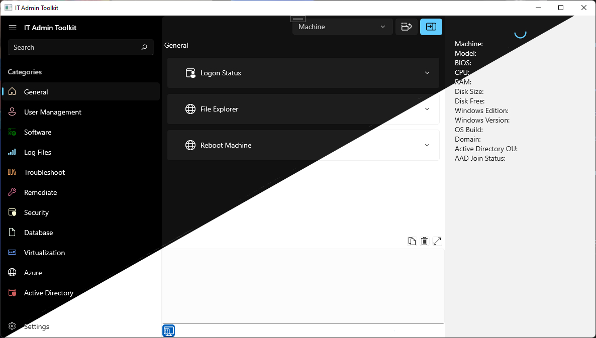

# IT Admin Toolkit
## A customizable and expandable destination for centralizing day-to-day job functions.

**Current Functionality (Alpha):**
- Core App, various placeholders/staged UI elements (machine info, terminal, etc.)
- Configurable XML to add categories or scripts as needed
    - View examples within XML folder
- Basic Launcher functionality for PowerShell 5 or PowerShell 7 scripts

**Features/Goals:**
- Open source, free, forever - Allow community contributions and provide credit to authors.
- Launcher - Provide a script launcher that can be easily customized (initially with XML) to centralize and launch script files across various languages.
- Accessibility - The core application seamlessly works with both Light and Dark modes and is Per-Monitor v2 DPI-aware.
- Task Scheduler - Create scheduled tasks, local or remote, quickly and easily from your script library.
- Reporting - Built-in logging and reporting statistics based on usage.
- Role Management - Manage groups of users (likely via AD Group Enrollment) to control script visibility.
- Remote Machine Info Panel - Quickly gain at a glance key information for inputted machines as needed.
- Built-In PowerShell Console - Choose whether you want your scripts to run in an integrated console or as a standalone process.
- Automatic update support - Choose whether you want to control update cycles or take them automatically.
- PowerShell Gallery integration -  Make it easy to add PS gallery scripts to your library from within the tool.
- Eventually, explore cross-platform support for macOS and Linux.

While you can of course submit issue or pull requests on the repo itself, please don’t hesitate to connect with me via any of the methods below:
- [Contact page](https://www.nkasco.com/contact)
- [LinkedIn](https://www.linkedin.com/in/nkasco/)
- [Reddit](https://www.reddit.com/user/nkasco)
- [Discord](https://discordapp.com/users/BusyGiraffe#8669)
